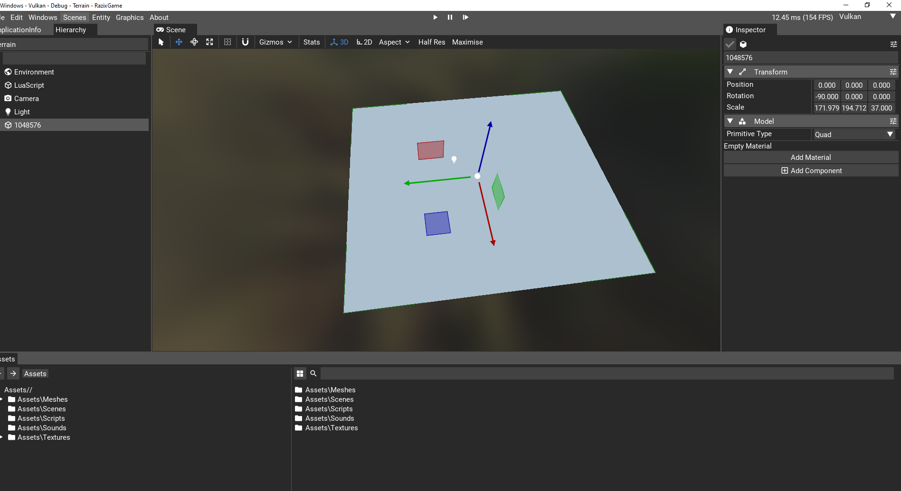

 
 <h1> Razix Engine </h1>
Razix is a High Performance Research Engine for production pipeline with emphasis on experimenting with different rendering techniques. Razix supports Windows, Mac, Linux, PSVita, PS3 and PS4 systems.

 ---

 # Currently Razix is WIP and the renderer is undergoing major design overhaul hence nothing will make sense
 ### However the old abstracted renderer (OpenGL + Vulkan) code is still in there (This will be replaced by TriWizard renderer)

 ## Screenshots
 

# About
Cross-Platform 2D and 3D engine with multi render API support (OpenGL, Vulkan DirectX 11, GXM, GCM, GNM and GNMX). Supports a wide range of Renders with extreme emphasis on scene optimization and implementing state-of-the art rendering techniques. The engine architecture supports a very educational and optimized design.

# Features
- Support for Windows, Linux, macOS, PSVita, PS3.
- Support for OpenGL, Vulkan DirectX 11,[ GXM, GCM, GNM and GNMX].
- 3D audio using OpenAL
- Rendering 3D models with deferred PBR shading.
- Editor GUI using ImGui.
- Multi Physics engine support.
- 3D physics using PhysX, Bullet and Havok.
- 2D physic using Box2D.
- Basic lua scripting support for entities.
- Extremely detailed profiling using Tracy, RenderDoc and Razor integrated deep into the engine systems.
- Supports Forward, Deffered and dynamic shadowds

# To be Updated...
